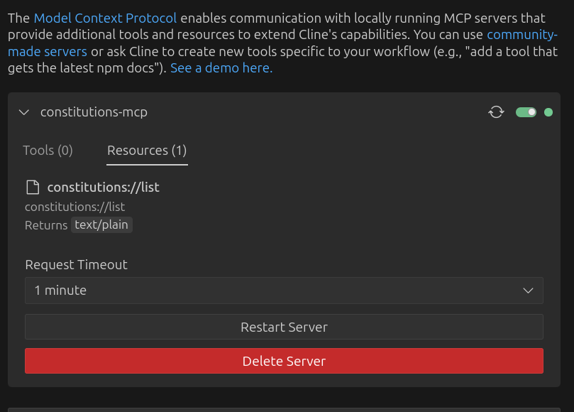

# Superego Langgraph Demo

### Instruction to running this locally
1. Backend

In superego-lgdemo:

```
python3 -m venv .venv
source .venv/bin/activate
pip install -r requirements.txt
python backend_server_async.py
```

2. Frontend

In superego-lgdemo/superego-frontend:

```
npm install
npm run dev
From your browser, http://localhost:5173/ gives you access to the frontend
```

3. MCP Configuration

- Our Constitutions are devised based on [Agentic AI Safety Rubric](https://www.nellwatson.com/agentic)
- These Constitutions offer a means to personalization where one can instruct the AI to adhere and steer towards their personal principles and beliefs. A Universal Ehtics Floor is developed by default
- To use these constitutions in your day to day interaction with AI, we provide an MCP Server. 

a. If your MCP Client supports SSE (like Cline/Cursor) here is an example configuration to connect to the Remote MCP server that offers our constitutions
```
{
  "mcpServers": {
    "ethical-constitutions": {
      "disabled": false,
      "timeout": 60,
      "url": "https://constitutions-onrender.com/mcp",
      "transportType": "sse"
    }
  }
}
```

b. If your MCP client doesn't support SSE (like Claude Desktop), here is an example configuration to connect to the Remote MCP server that offers our constitutions

```
Install the package mcp-proxy using a package manager of your choice. 
Ex: pip install mcp-proxy

{
    "mcpServers": {
      "ethical-constitutions": {
          "command": "<Path to where mcp-proxy has been installed>/mcp-proxy",
          "args": ["https://constitutions-onrender.com/mcp"]
      }
    }
  }

```

3.1 Local MCP Configuration
- Using Cline, a VS Code extension that supports MCP resources, you can use constitutions as follows:
- Clone this repository
- Setup [uv](https://docs.astral.sh/uv/getting-started/installation/)
- Add a `constitutions-mcp` entry to your `mcpServers` field in your cline settings file.
- Here is an example:
```
{
  "mcpServers": {
    "constitutions-mcp": {
      "disabled": false,
      "timeout": 60,
      "command": "uv",
      "args": [
        "--directory",
        "/ABOLUTE_INSTALL_PATH/superego-lgdemo",
        "run",
        "constitution_mcp_server.py"
      ],
      "transportType": "stdio"
    }
  }
}

```
- You should now see the Constitutions MCP Server with a green toggle and the relevant resources:

